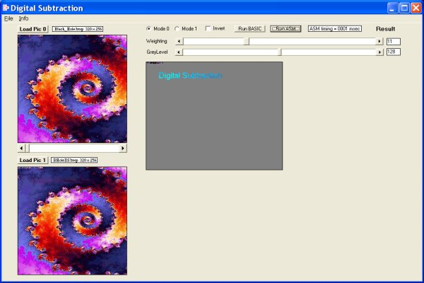



## Digital Image Subtraction\(Updated\)

### Description

Digital Image Subtraction by Robert Rayment. (Updated: faster Basic routine, ASM action on Weighting & GreyLevel scrollbars) Demonstrates the power of MMX machine code which is at least 10 times faster than Basic in an optimally compiled EXE. See Info for limitations. Sample BMPs. Assumes MMX & QueryPerform.. APIs. Zip 123 KB.
 
### More Info
 
Pictures

Just run

             |
---                |---
**Submitted On**   |2005-02-17 17:01:08
**By**             |[Robert Rayment](https://github.com/Planet-Source-Code/PSCIndex/blob/master/ByAuthor/robert-rayment.md)
**Level**          |Intermediate
**User Rating**    |5.0 (30 globes from 6 users)
**Compatibility**  |VB 6\.0
**Category**       |[Graphics](https://github.com/Planet-Source-Code/PSCIndex/blob/master/ByCategory/graphics__1-46.md)
**World**          |[Visual Basic](https://github.com/Planet-Source-Code/PSCIndex/blob/master/ByWorld/visual-basic.md)
**Archive File**   |[Digital\_Im1854762192005\.zip](https://github.com/Planet-Source-Code/robert-rayment-digital-image-subtraction-updated__1-58968/archive/master.zip)

### API Declarations

A few see code

